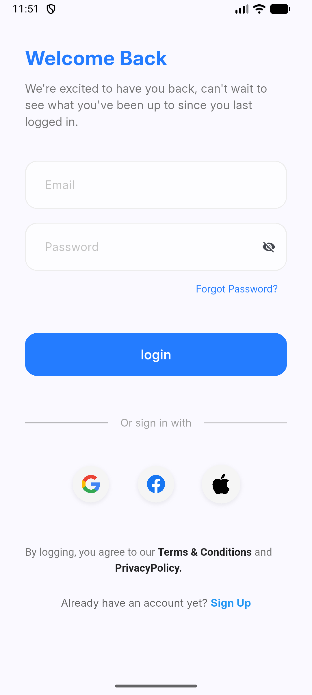
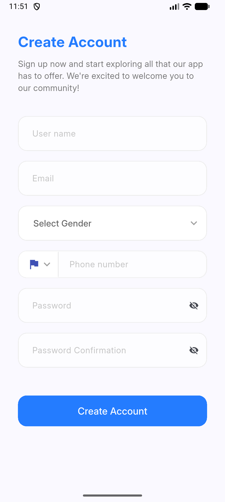
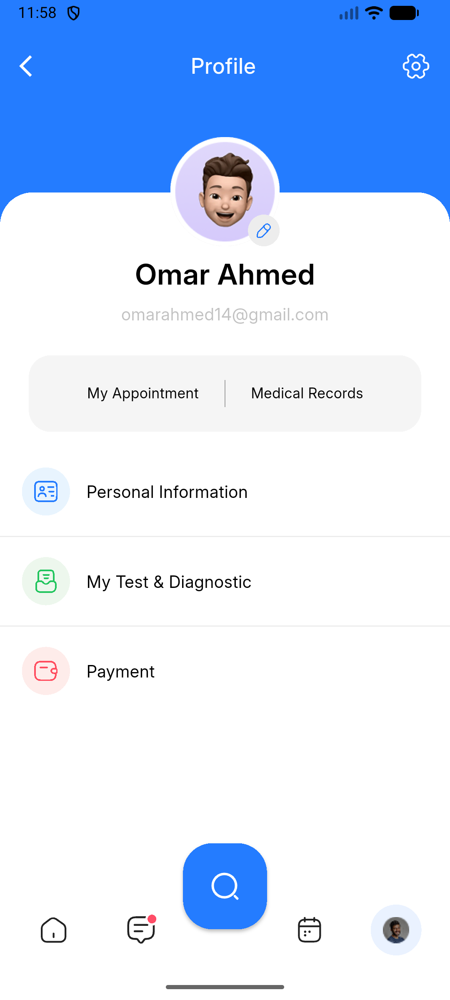
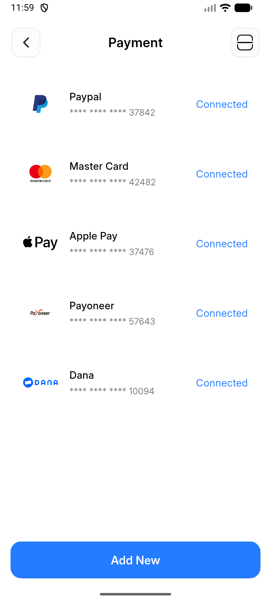
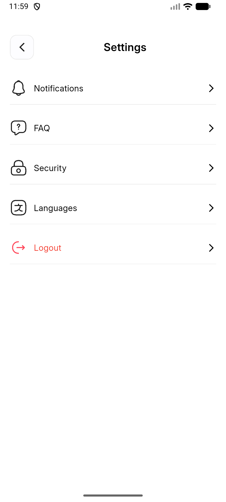
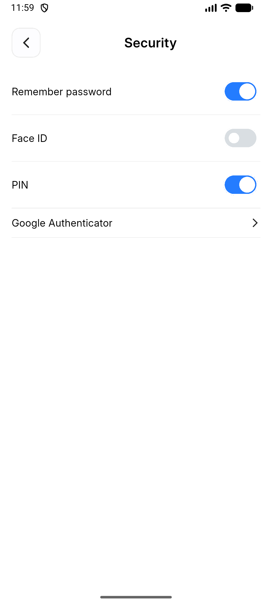

# 🩺 Doc-Appointment App

## 📄 Table of Contents

1. [🚀 Introduction](#introduction)
2. [🛠️ Installation & Setup](#installation)
3. [🤝 Contribution Guide](#contribution)
4. [💻 Technical Stack](#tech-stack)
5. [🎥 Demo Video](#demo)
6. [✨ Features](#features)
7. [📸 Screenshots & Design](#screenshots)
8. [👥 Contributors](#contributors)

---

## <a id="introduction"></a> 🚀 Introduction

**Doc App** is a comprehensive medical appointment booking application built with Flutter. It is designed to bridge the gap between patients and healthcare providers, offering a seamless user interface for finding doctors, scheduling appointments, and managing medical consultations. 

🎨 **UI/UX Design:** The application is pixel-perfect and faithfully developed from this [Figma Design](https://www.figma.com/design/WB4GtMqCEZqJtuaWXd2oYd/Omar---Appointment-App?node-id=0-1&p=f&t=G2gXPKthYZDvDfhO-0).

---

## <a id="installation"></a> 🛠️ Installation & Setup

To run this project locally, ensure you have [Flutter](https://flutter.dev/docs/get-started/install) installed on your machine.

**1. Clone the repository:**
```bash
git clone https://github.com/Mohamed1Kamal/Doc_App.git
```

**2. Navigate to the project directory:**
```bash
cd flutter_projects
```

**3. Install dependencies:**
```bash
flutter pub get
```

**4. Run the app:**
```bash
flutter run
```

---

## <a id="contribution"></a> 🤝 Contribution Guide

Contributions are welcome! If you want to improve this app, please follow these steps:

1. **Fork** the repository.
2. **Create a new branch:** `git checkout -b feature/your-feature-name`
3. **Commit your changes:** `git commit -m 'Add some feature'`
4. **Push to the branch:** `git push origin feature/your-feature-name`
5. **Open a Pull Request** and describe your changes.

---

## <a id="tech-stack"></a> 💻 Technical Stack

* **Framework:** Flutter
* **Language:** Dart
* **Architecture:** Clean Architecture / MVVM
* **State Management:** Bloc / Cubit
* **Networking:** Dio / REST APIs with freezed and retrofit
* **Routing:** App Router
* **Design Implementation:** Figma to Flutter

---

## <a id="demo"></a> 🎥 Demo Video

*(Replace this text with a GIF or a link to a YouTube/LinkedIn video showing your app in action!)*
> [Watch the Demo Video Here](#) 

---

## <a id="features"></a> ✨ Features

* **Find Doctors:** Browse through a comprehensive list of specialists.
* **Book Appointments:** Seamlessly schedule, reschedule, or cancel doctor visits.
* **Doctor Profiles:** View doctor credentials, reviews, and availability.
* **User Dashboard:** Manage your upcoming and past medical appointments.
* **Dynamic FAQ Section:** Interactive Help Center to answer common patient questions.
* **Responsive UI:** Adapts beautifully to different screen sizes.

---

## 📷 Screenshots

| Onboarding | Login                                             | Register                                           |
|------------------------------|---------------------------------------------------|--------------------------------------------------------|
|  | |  |

| Profile                                              | Payment                                                      | Settings                                             |
|-----------------------------------------------------|---------------------------------------------------------------------|---------------------------------------------------|
|  |  |  |

| Security                                             |
|---------------------------------------------------|
|  |

---

## <a id="contributors"></a> 👥 Contributors

* **Mohamed Kamal** - *Flutter Developer* - [GitHub](https://github.com/YOUR-USERNAME) | [LinkedIn](https://linkedin.com/in/YOUR-LINKEDIN)
